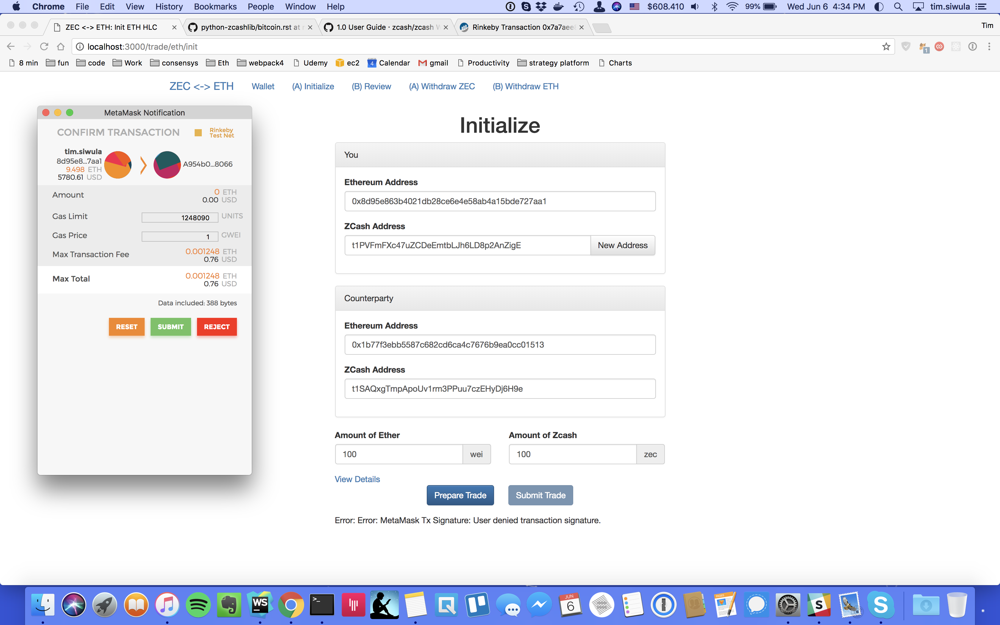

# Atomic trades for ZEC <-> ETH

## Swap Initialize Example


## Dependencies:
```
node, npm, truffle, python3, python-zcashlib, infura
```

## Install Dev dependencies:
```
npm install
```

## Deploy the contracts to paritys kovan test network
`truffle compile`
truffle migrate --reset --compile-all --network="kovan"
```truffle deploy --network="kovan"```

then open up the [parity-js shell ui electron app](https://github.com/parity-js/shell/releases/tag/v0.1.4), edit the 
gas amount to `2000000` and enter your account password, should get 
something like this:
``` 
Using network 'kovan'.

Running migration: 2_deploy_contracts.js
  Deploying hashlock...
  ... 0x43de5163939f7720edb1013becf93667792722f9d11fea416f28510839b9b204
  hashlock: 0xee93953861f133aaad02dd887da7ba8b35da6edb
Saving successful migration to network...
  ... 0x4f4014529b2ee55a96379f5119a6cd3d3d44afae2720e482596b0aea873d099b
Saving artifacts...


```

Grab the contract address above `0xee93953861f133aaad02dd887da7ba8b35da6edb` and confirm it was deployed on 
[ether scan kovan network](https://kovan.etherscan.io/address/0xee93953861f133aaad02dd887da7ba8b35da6edb)

After you deploy the contract, get the hashlock contract address and update it in `index.js` 

## To run, serve index.js and visit it locally in your browser.

`node index.js` or `npm run start`

Visit
`http://localhost:3000/`

## macbook zcash client

Download and install the [zcash macbook client](https://github.com/kozyilmaz/zcash-apple)


### zcash test network

-- todo


## to do
* update `ZBXCAT/zXcat.py` with testnet link to zcashd -daemon -testnet
* get test zcash into wallet from [zcash faucet](https://faucet.testnet.z.cash/) 
* see zcash.rpc.Proxy for interfacing with the zcash client

## To test:

Be sure you have the Metamask plugin installed, and have an account with some testnet ETH on rinkeby.

Run the zcashd client locally, in `-testnet` mode.


## community support
Chat with us on RocketChat at [zcash/alachemy](https://chat.zcashcommunity.com/channel/alchemy)
or on Gitter at [buidldao/Zcash-Eth-Atomic-Trades](https://gitter.im/buidldao/Zcash-Eth-Atomic-Trades)

